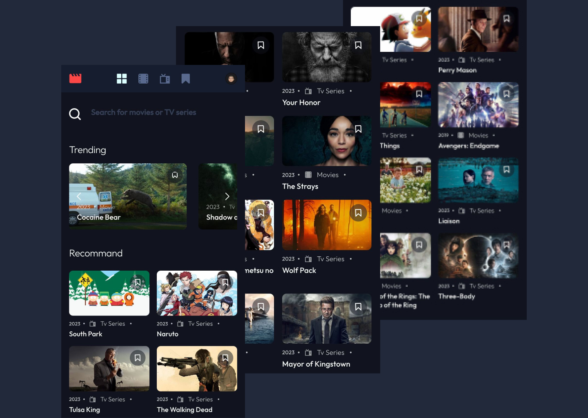

# NetFlims

# Welcome ! 👋



### Links

- Live site URL: https://netflims.netlify.app/

## Available scripts

## `yarn install`

Create _.env_ file

```
VITE_API_KEY=SUPABASE_API_KEY
VITE_ANON_API_KEY=SUPABASE_ANON_KEY
VITE_PROJECT_URL=SUPABASE_URL_PROJECT

# EMAIL JS KEY
VITE_SERVICE_ID=EMAIL_SERVICE_KEY
VITE_TEMPLATE_ID=TEMPLATE_EMAIL_KEY
VITE_PUBLIC_KEY=PUBLIC_EMAIL_KEY
```

## `yarn start`

## The process

- [ReactJs](https://reactjs.org)
- [SASS](https://sass-lang.com)
- [Formik](https://formik.org)
- [EmailJS](https://www.emailjs.com/)
- [Swiper](https://swiperjs.com/)
- [React-toastify](https://www.npmjs.com/package/react-toastify)

## CONTRIBUTER

|                                                                  |                                                                      |                                                                                |
| ---------------------------------------------------------------- | -------------------------------------------------------------------- | ------------------------------------------------------------------------------ |
|  |  |  |
| [**Sami**](https://github.com/Blazrr)                            | [**Ali**](https://github.com/alinfor)                                | [**Alexandre-st**](https://github.com/Alexandre-st)                            |
